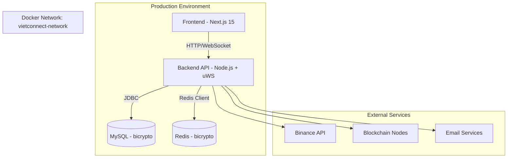
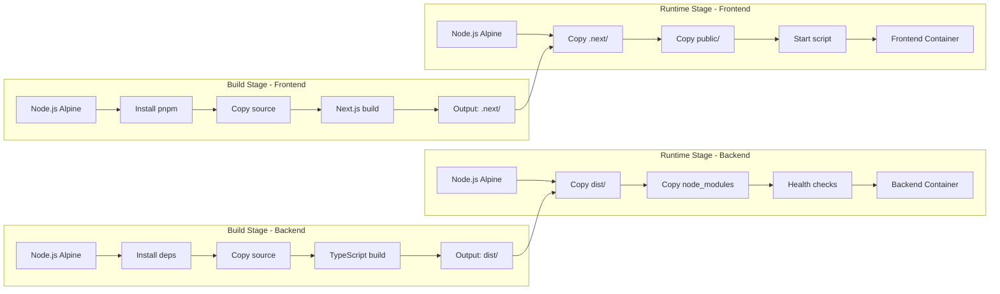

# 🏗️ System Design & Docker Architecture - VIETCONNECT SOLUTIONS

## Architecture Overview
**Current Production Architecture:**

### Key Components & Responsibilities:

#### **Frontend (Next.js 15 + React 19)**
- **Technology**: Next.js 15, React 19, TypeScript, Tailwind CSS
- **Features**: Multi-language (i18n), Web3 integration, Real-time trading UI
- **Modules**: Exchange, NFT, P2P, Staking, Investment, Blog, Admin Panel
- **Port**: 3000

#### **Backend (Node.js + uWebSockets)**
- **Technology**: Node.js 18, TypeScript, uWebSockets.js, Sequelize
- **Features**: REST API, WebSocket, Cron Jobs, AI Integration (DeepSeek)
- **Modules**: Auth, Exchange, Finance, Admin, Blog, CRM, NFT, P2P, Staking
- **Port**: 4000

#### **Database Layer**
- **MySQL**: User data, transactions, orders, content management
- **Redis**: Caching, sessions, real-time data, queues

#### **External Integrations**
- **Blockchain**: Solana, TON, Tron, Monero, Bitcoin
- **Exchanges**: Binance API integration
- **Services**: Email (SMTP), SMS (Twilio), Payment gateways

## 🐳 Docker Architecture Design

### **Proposed Multi-stage Docker Architecture:**

### **Technology Stack Rationale:**

#### **Base Images:**
- **Node.js 18 Alpine**: Minimal size, security, uWS.js compatibility
- **Multi-stage builds**: Optimize image size và build time
- **Non-root users**: Security best practices

#### **Backend Optimizations:**
- **uWebSockets.js**: High-performance WebSocket server
- **Sequelize ORM**: Type-safe database operations
- **PM2**: Process management trong production
- **TypeScript**: Type safety và maintainability

#### **Frontend Optimizations:**
- **Next.js 15**: Latest features, performance optimizations
- **React 19**: Concurrent features, improved DX
- **Tailwind CSS**: Utility-first styling, small bundle size
- **pnpm**: Fast package management, disk efficiency

## Data Models
**What data do we need to manage?**

- Core entities and their relationships
- Data schemas/structures
- Data flow between components

## API Design
**How do components communicate?**

- External APIs (if applicable)
- Internal interfaces
- Request/response formats
- Authentication/authorization approach

## Component Breakdown
**What are the major building blocks?**

- Frontend components (if applicable)
- Backend services/modules
- Database/storage layer
- Third-party integrations

## Design Decisions
**Why did we choose this approach?**

- Key architectural decisions and trade-offs
- Alternatives considered
- Patterns and principles applied

## Non-Functional Requirements
**How should the system perform?**

- Performance targets
- Scalability considerations
- Security requirements
- Reliability/availability needs

